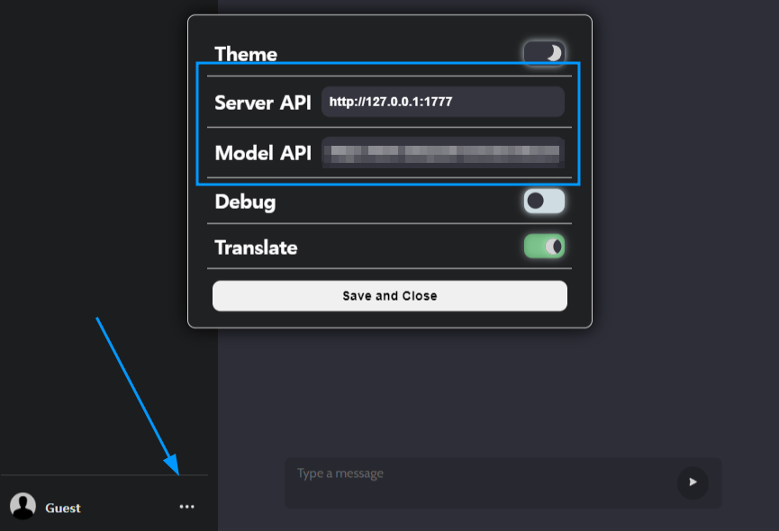
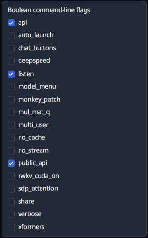

# AIT

## [>> CLICK HERE <<](https://port-0-front-jvpb2mlo5d0nyx.sel5.cloudtype.app/chat)

AI Assistant for custom features.

## Preview

## Development

- Start dev server

```bash
pnpm i  # npm/yarn whatever
pnpm dev
```

- Build and preview

```bash
pnpm build
pnpm preview # '--host' argument for network access
```  

### Prerequisites

- [AIT 서버](https://github.com/project-ait/server)가 필요합니다.
    - 자세한 실행 방법은 [Project-AIT/Server의 README](https://github.com/project-ait/server/blob/main/README.md)를 확인하세요.
    - 설정의 Server API에 해당합니다.
- Oobabooga의 [text-generation-webui](https://github.com/oobabooga/text-generation-webui)가 필요합니다.
    - **!! 모델을 미리 로드해야 합니다 !!**
    - `--api --listen --public-api` 인자와 함께 실행하세요.
        - `--public-api` 인자로 인해 다음과 같은 형식의 공개 터널이 생성됩니다: `*.trycloudflare.com`
    - 설정의 Model API에 해당합니다.

| Place URLs                                 | Text Generation WebUI                         |
|--------------------------------------------|-----------------------------------------------|
|  |  |

### Project Structure

Find out
